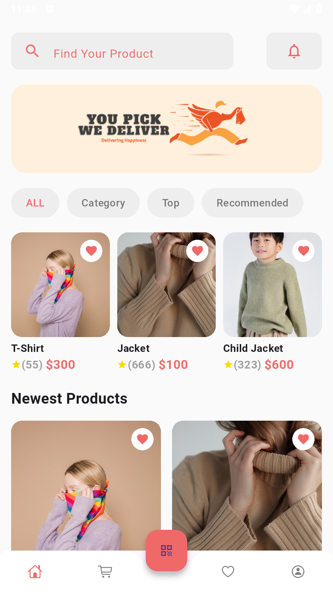
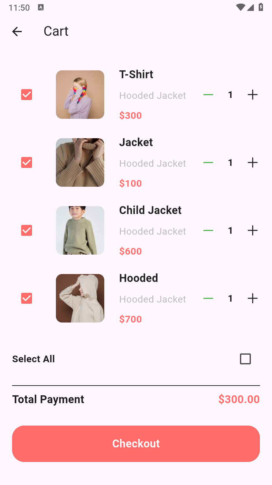

# 🛍️ E-commerce Flutter App

A modern and feature-rich e-commerce mobile application built with Flutter, providing a seamless shopping experience for users.

## 📱 Features

- **User Authentication**: Secure login and registration system
- **Product Catalog**: Browse products with categories and search functionality
- **Shopping Cart**: Add, remove, and manage items in cart
- **Product Details**: Detailed product information with images and reviews
- **User Profile**: Manage personal information and preferences
- **Order Management**: Track orders and view order history
- **Payment Integration**: Secure payment processing
- **Wishlist**: Save favorite products for later
- **Responsive Design**: Optimized for different screen sizes

## 🚀 Getting Started

### Prerequisites

Before running this application, make sure you have the following installed:

- [Flutter SDK](https://docs.flutter.dev/get-started/install) (Version 3.0.0 or higher)
- [Dart SDK](https://dart.dev/get-dart) (Version 2.17.0 or higher)
- [Android Studio](https://developer.android.com/studio) or [VS Code](https://code.visualstudio.com/)
- Android/iOS emulator or physical device

### Installation

1. **Clone the repository**
   ```bash
   git clone https://github.com/yourusername/ecommerce-flutter-app.git
   cd ecommerce-flutter-app
   ```

2. **Install dependencies**
   ```bash
   flutter pub get
   ```

3. **Run the application**
   ```bash
   flutter run
   ```

## 🏗️ Project Structure

```
lib/
├── main.dart                 # App entry point
├── models/                   # Data models
│   ├── product.dart
│   ├── user.dart
│   └── order.dart
├── screens/                  # UI screens
│   ├── home/
│   ├── auth/
│   ├── product/
│   ├── cart/
│   └── profile/
├── services/                 # Business logic and API calls
│   ├── auth_service.dart
│   ├── product_service.dart
│   └── payment_service.dart
├── widgets/                  # Reusable UI components
│   ├── custom_button.dart
│   ├── product_card.dart
│   └── loading_widget.dart
├── utils/                    # Utility functions and constants
│   ├── constants.dart
│   ├── helpers.dart
│   └── validators.dart
└── providers/                # State management
    ├── auth_provider.dart
    ├── cart_provider.dart
    └── product_provider.dart
```

## 📦 Dependencies

### Main Dependencies
```yaml
dependencies:
  flutter:
    sdk: flutter
  provider: ^6.0.5           # State management
  http: ^0.13.5             # HTTP requests
  shared_preferences: ^2.0.15 # Local storage
  image_picker: ^0.8.6      # Image selection
  cached_network_image: ^3.2.3 # Image caching
```

### Dev Dependencies
```yaml
dev_dependencies:
  flutter_test:
    sdk: flutter
  flutter_lints: ^2.0.0
```

## 🎨 UI/UX Design

- **Material Design**: Following Google's Material Design principles
- **Dark/Light Theme**: Support for both theme modes
- **Responsive Layout**: Adaptive design for tablets and phones
- **Smooth Animations**: Enhanced user experience with fluid transitions

## 🔧 Configuration

### API Configuration
1. Create a `.env` file in the root directory
2. Add your API endpoints:
   ```
   API_BASE_URL=https://your-api-url.com
   PAYMENT_API_KEY=your-payment-key
   ```

### Firebase Setup (Optional)
If using Firebase for authentication or analytics:
1. Add your `google-services.json` (Android) to `android/app/`
2. Add your `GoogleService-Info.plist` (iOS) to `ios/Runner/`

## 🧪 Testing

Run tests using:
```bash
# Run all tests
flutter test

# Run tests with coverage
flutter test --coverage
```

## 📱 Screenshots

| Home Screen | Product Details | Shopping Cart | User Profile |
|-------------|-----------------|---------------|--------------|
|  |  |  |

## 🚀 Build & Release

### Android
```bash
# Build APK
flutter build apk --release

# Build App Bundle
flutter build appbundle --release
```

### iOS
```bash
# Build for iOS
flutter build ios --release
```

## 🤝 Contributing

1. Fork the repository
2. Create your feature branch (`git checkout -b feature/AmazingFeature`)
3. Commit your changes (`git commit -m 'Add some AmazingFeature'`)
4. Push to the branch (`git push origin feature/AmazingFeature`)
5. Open a Pull Request

## 📝 License

This project is licensed under the MIT License - see the [LICENSE](LICENSE) file for details.

## 📞 Contact

- **Developer**: Your Name
- **Email**: your.email@example.com
- **GitHub**: [@yourusername](https://github.com/yourusername)
- **LinkedIn**: [Your LinkedIn](https://linkedin.com/in/yourprofile)

## 🙏 Acknowledgments

- Flutter team for the amazing framework
- Material Design for UI guidelines
- All contributors who helped improve this project

---

**Made with ❤️ using Flutter**
